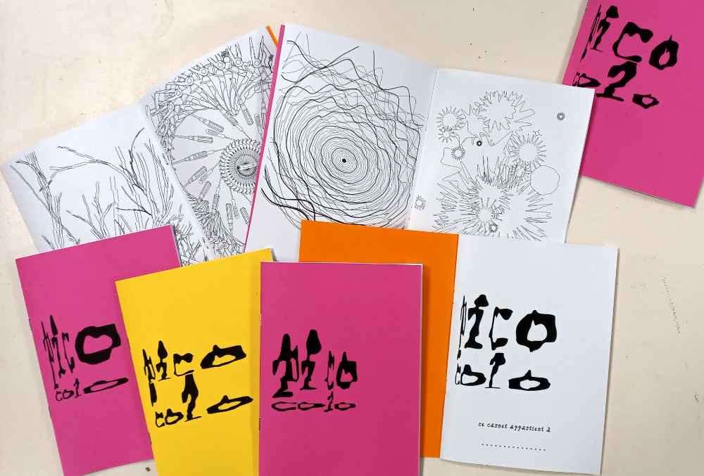

# picocolo

Carnet de coloriage génératif

Impression de la couverture sur papier 160g  
Les 3 feuillets A4 sont imprimés en recto verso bord court sur papier 100g  
Plié à la main et relié à l'agrafeuse Novus B54/3  

**version_20240601** : version fonctionnelle mais largement améliorable